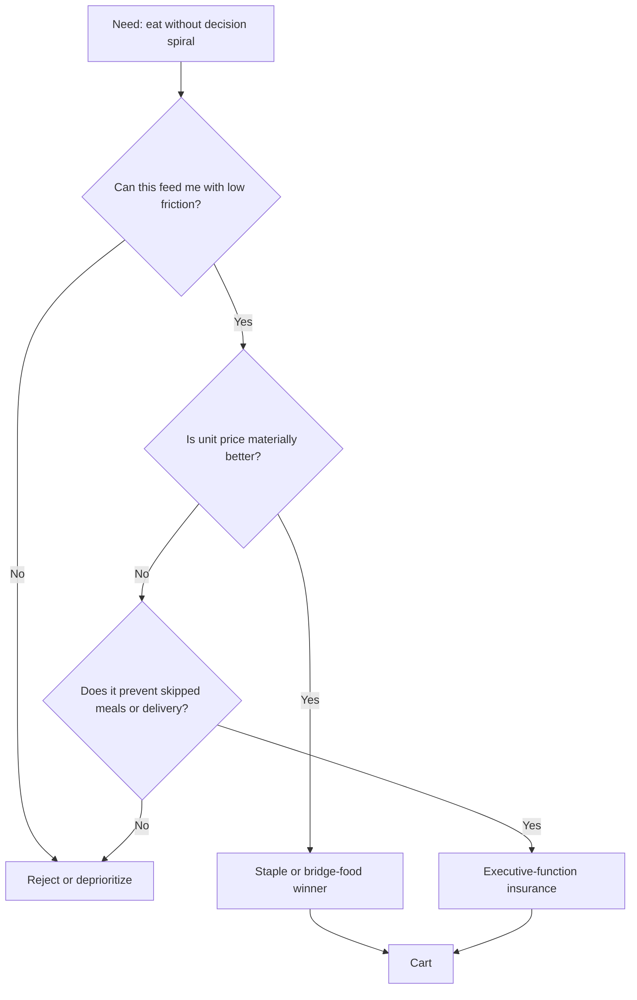
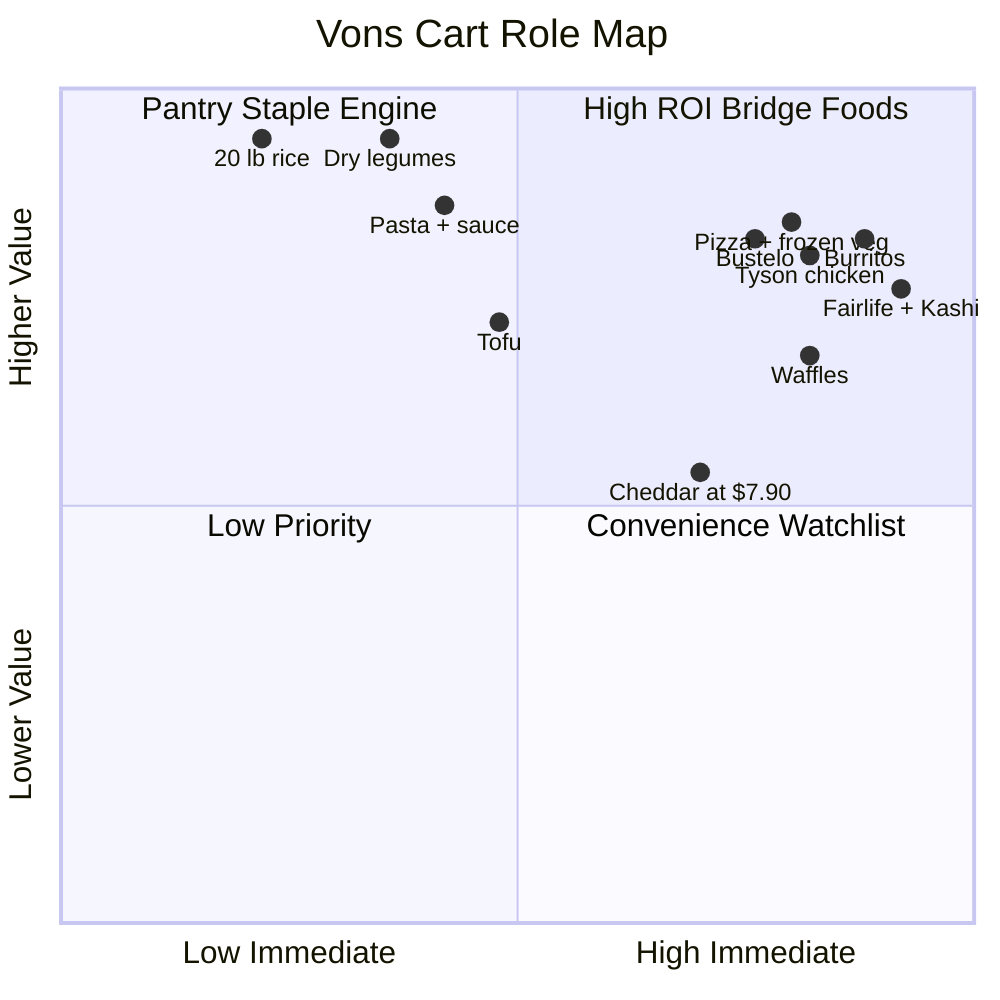
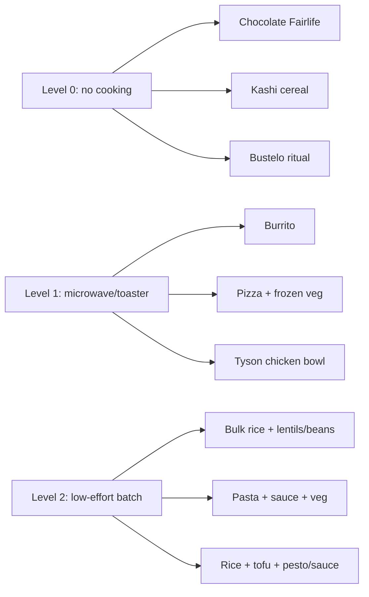

# Vons Cart Decision Analysis

Updated: 2026-05-20
Cart status: Draft only. No checkout submitted.
Original live cart check used for this analysis: 18 items, estimated subtotal $89.03 after savings / $106.02 before savings.
Latest live cart check after later user corrections: 23 items, estimated subtotal $114.88 after savings / $138.87 before savings. No checkout submitted.

Note: this analysis began from an earlier optimization pass. Later user choices removed or rejected some bridge foods, and the final live cart now uses dry garbanzos, dry pinto beans, lentils, and Tyson diced chicken instead of canned beans and Just Bare.

## Executive Summary

The cart is doing two jobs at once:

1. Lower food cost with bulk staples and better unit prices.
2. Reduce executive-function load with reliable bridge foods that can become food in 0-5 minutes.

The highest-ROI decisions were the replacements that preserved the same behavioral function while improving quantity and unit economics: real pizza instead of cauliflower pizza, burritos instead of taquitos, family-size waffles instead of premium/protein waffles, Bustelo instead of expensive moka coffee, Tyson diced chicken instead of Just Bare, and dry legumes instead of canned beans.

## Decision System



## Visual Decision Map



## Replacement Wins

Lower unit cost is better.

### Pizza

```text
Signature SELECT Rising Crust Supreme   $0.15/oz | ####
Open Nature Cauliflower Pizza           $0.56/oz | ###############
```

Decision: keep the Signature SELECT real pizza.

Why: it is about 3.78x cheaper per ounce and about 2.91x more food by weight than the removed cauliflower pizza.

### Taquito Function

```text
El Monterey Bean & Cheese Burritos       $0.20/oz | #####
El Monterey Chicken/Cheese Taquitos      $0.45/oz | ############
```

Decision: use burritos as the default immediate microwave food.

Why: burritos preserve the same "microwave and eat" function while cutting unit cost by about 55% and giving more filling food.

### Waffle Function

```text
Signature SELECT Homestyle Waffles       $0.19/oz | #####
Eggo family-size reference               $0.24/oz | ######
Protein waffle reference                 $0.37/oz | ##########
```

Decision: use the family-size Signature SELECT waffles.

Why: they are about 21.5% cheaper per ounce than the Eggo reference and 50% cheaper per ounce than the protein waffle reference. In the current cart, protein is better covered by Fairlife, Tyson chicken, tofu, cheese, and legumes.

### Protein Swap

```text
Tyson diced grilled chicken              ~$7.27/lb | #######
Just Bare cooked chicken fillets         ~$9.33/lb | #########
```

Decision: replace Just Bare with Tyson diced grilled chicken.

Why: Tyson preserves the fully cooked frozen chicken use case while lowering the price per pound.

### Rice Strategy

```text
20 lb Botan Calrose rice                 ~$1.00/lb | ####
5 lb Calrose reference                   ~$1.40/lb | ######
```

Decision: keep bulk rice as the value engine.

Why: ready rice was removed/rejected in the live cart signal, so do not re-add it automatically without a fresh reason.

## All Decisions Compared

| Decision | Winner | Compared Against | Main Reason | Role |
| --- | --- | --- | --- | --- |
| Real pizza | Signature SELECT Rising Crust Supreme | Open Nature cauliflower pizza | Much more food, far lower unit cost, better fit for "real pizza" request | Immediate meal |
| Taquito replacement | El Monterey bean & cheese burritos | Taquitos | Same microwave behavior, more filling, ~55% lower unit cost | Immediate meal |
| Waffles | Signature SELECT Homestyle Waffles | Eggo/protein waffles | More servings for the same or lower price | Immediate breakfast |
| Rice | 20 lb Botan Calrose | 5 lb rice | Bulk staple saves ~28.5% per pound | Staple engine |
| Beans | Dry garbanzos, pinto, and lentils | Canned beans | Better cooked yield, matches user preference, still low planning if soaked/batched | Staple protein/fiber |
| Meat protein | Tyson diced chicken | Just Bare fillets | Preserves fully cooked frozen convenience at lower cost per pound | Low-friction protein |
| Pasta | Signature SELECT rigatoni | Barilla rigatoni | Same pantry role, lower price | Low-effort meal base |
| Tomato sauce | Signature SELECT tomato basil | O Organics sauce | Lower unit price | Low-effort meal base |
| Pesto | Signature SELECT pesto | Barilla pesto | Better unit price | Flavor shortcut |
| Frozen veg | Signature SELECT California veg | O Organics frozen veg | Lower price for same freezer role | Nutrition shortcut |
| Tofu | Azumaya extra firm | O Organics tofu | Lower price, acceptable tradeoff | Protein base |
| Cheese | Lucerne sharp cheddar | Smaller cheese blocks | Still useful, but coupon mismatch needs review | Watchlist |
| Brown sugar | 32 oz Signature SELECT | Smaller bag | Better unit price | Pantry staple |
| Cereal | Kashi Go Peanut Butter | Removing cereal entirely | Safe/repeatable breakfast, half-off sale | Level 0 food |

## Neurodivergent-Friendly Meal Ladder



## ROI Ranking

| Rank | Decision | ROI Logic |
| ---: | --- | --- |
| 1 | Burritos replacing taquitos | Biggest immediate-food upgrade: cheaper, more filling, same microwave behavior. |
| 2 | Real pizza replacing cauliflower pizza | Better satisfies the actual craving and massively improves food-per-dollar. |
| 3 | Tyson replacing Just Bare | Keeps fully cooked chicken convenience while lowering cost per pound. |
| 4 | Dry lentils, garbanzos, and pinto replacing canned beans | Cheapest durable meal architecture in the cart, and it matches stated preferences. |
| 5 | Bulk rice + legumes | Lowest-cost repeatable base for bowls, tofu, chicken, cheese, and vegetables. |
| 6 | Bustelo correction | Familiar moka-compatible coffee at much better quantity-per-dollar than Lavazza. |
| 7 | Waffles + Kashi | Preserves instant breakfast options without premium pricing. |
| 8 | Cheddar | Useful, but coupon mismatch means it needs approval attention. |

## Keep / Watch / Optional Swap

| Status | Items |
| --- | --- |
| Keep | Burritos, real pizza, 20 lb rice, dry garbanzos, dry pinto, lentils, Tyson chicken, tofu, pasta, pasta sauce, frozen veg, Kashi, Fairlife, Bustelo |
| Watch | Cheddar because the coupon did not apply as expected |
| Optional future adds | Salsa/hot sauce, eggs or hard-boiled eggs, canned chili/soup, bananas/apples/baby carrots, tuna/chicken packets or cottage cheese |

## Research Anchors

- USDA MyPlate budget and time-saving guidance: https://www.myplate.gov/eathealthy/budget/budget-weekly-meals
- CHADD ADHD dinner planning guidance: https://chadd.org/adhd-weekly/whats-for-dinner-tips-for-healthy-meal-planning/
- Today's Dietitian neurodivergent meal-planning framework: https://www.todaysdietitian.com/flexible-meal-planning-for-autism-and-adhd/
